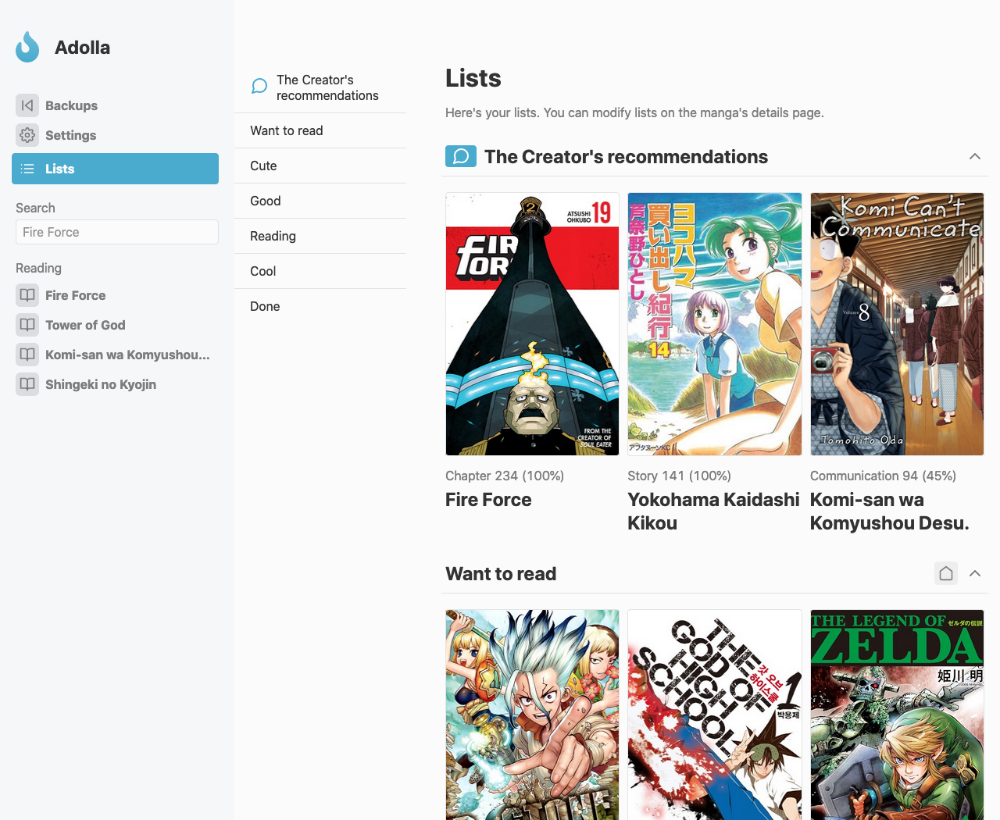
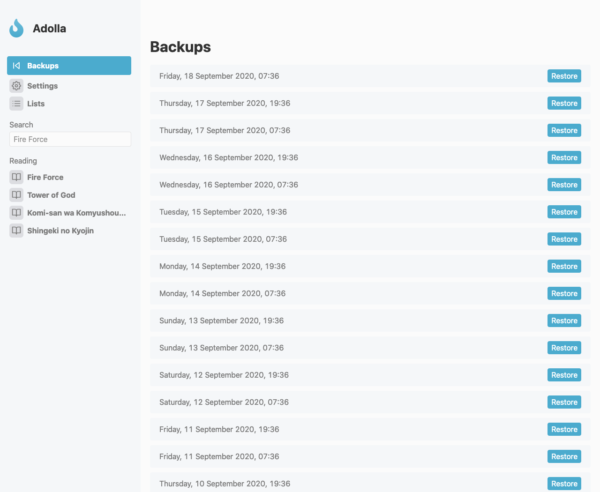
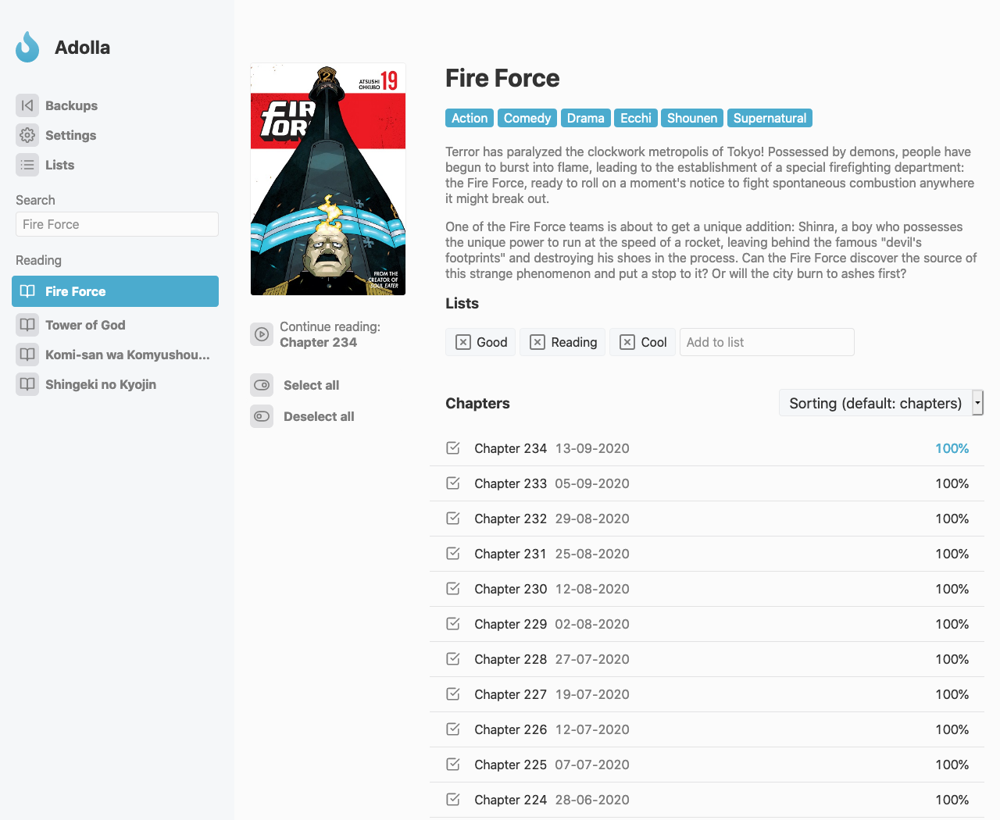
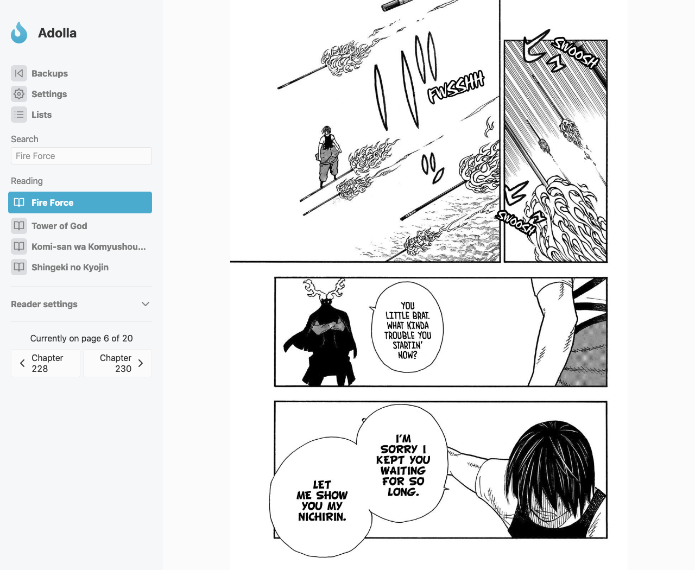

# Adolla

Easy to use web app to read Manga.

## Features

- Easy progress tracking
- A light and dark theme
- Multiple icons to pick from
- Automatic backups every 12 hours
- Lists to store manga in
- A customizable reader
- Standalone iOS support
- Is a PWA
- Easy navigation from anywhere in the app
- Telegram intergration to notify you about new chapters

## Setup

To set this up, clone the repo. Navigate to the project root and install the relevant packages. This can be done with `npm install`. 

Then, to start the app, run `npm start`. This will host the web server.

## Screenshots

