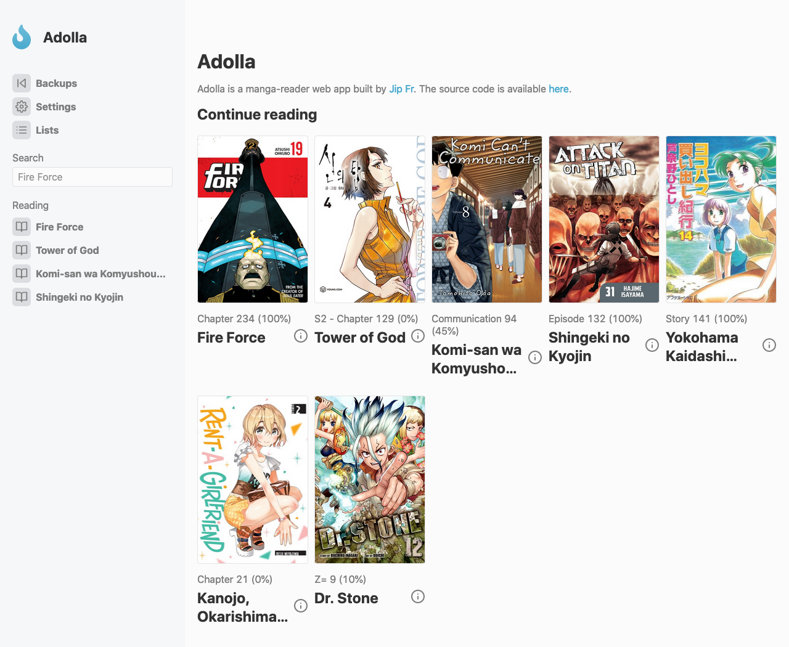

# Adolla

Easy to use web app to read Manga.

## Setup

To set this up, clone the repo. Navigate to the project root and install the relevant packages. This can be done with `npm install`. 

Then, to start the app, run `npm start`. This will host the web server.

## Screenshots

